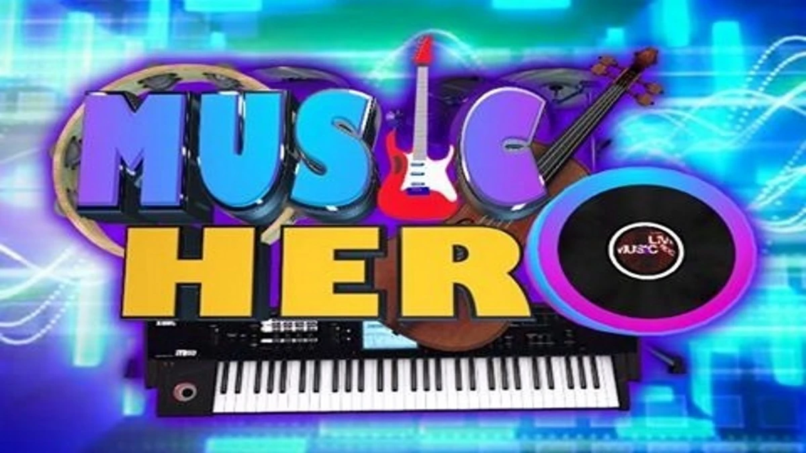

# Music Composition Site (built by [AutoCode](https://autocode.work) in 20 minutes)

This project aims to create a web-based platform for music composition, offering tools and resources
for musicians and composers.



# DEMO

https://music-composer.netlify.app/

## Features

-   Interactive music notation editor
-   Virtual instrument library
-   Chord progression generator
-   Melody suggestion tool
-   Real-time collaboration for ensemble compositions
-   Audio playback and export functionality

## Technology Stack

-   React.js for front-end development
-   Web Audio API for sound generation and processing
-   Tone.js for advanced audio synthesis and effects
-   react-router-dom v6

## Design Considerations

-   Responsive design for desktop and mobile use
-   Intuitive user interface for both beginners and professionals
-   Scalable architecture to support future feature additions
-   Optimized performance for handling complex musical data
-   Modular component structure for easier maintenance and testing
-   Accessibility features for users with disabilities
-   Dark mode support for reduced eye strain during long composition sessions
-   Offline mode capabilities for composing without an internet connection

## Roadmap

1. Implement basic notation editor
2. Integrate virtual instrument sounds
3. Develop chord progression and melody suggestion algorithms
4. Add real-time collaboration features
5. Implement audio export functionality
6. Enhance UI/UX based on user feedback
7. Implement offline mode and local storage
8. Add support for custom instrument samples
9. Develop a mobile app version for on-the-go composition

## Getting Started

1. Clone the repository
2. Install dependencies: `npm install`
3. Start the development server: `npm start`

## Project Structure

```
music-composition-site/
├── package.json
├── public/
│   └── index.html
└── src/
    ├── components/
    │   ├── NotationEditor/
    │   ├── InstrumentLibrary/
    │   ├── ChordProgression/
    │   └── MelodySuggestion/
    ├── hooks/
    ├── contexts/
    ├── utils/
    ├── styles/
    ├── App.js
    └── index.js
```

## Contributing

We welcome contributions from the community. Please read our contributing guidelines before
submitting pull requests.

## License

This project is licensed under the MIT License. See the LICENSE file for details.

# TODO

-   make nice design
-   Fix Uncaught runtime errors:
×
ERROR
Invalid argument(s) to setValueAtTime: "F/4", 14.849333333333332
    at assert (http://localhost:3000/static/js/bundle.js:79954:11)

    
1. Create a basic user interface for the notation editor (5 story points)
   - Implement a staff with clickable note positions
   - Add functionality to input and delete notes

2. Implement note rendering in the notation editor (3 story points)
   - Render notes on the staff based on user input
   - Ensure proper spacing and alignment of notes

3. Integrate Web Audio API for real-time playback (5 story points)
   - Set up audio context and basic sound generation
   - Implement play/pause functionality for the composed melody

4. Create a basic virtual instrument library (3 story points)
   - Implement 3-5 basic instruments (e.g., piano, guitar, flute)
   - Create a simple interface for instrument selection